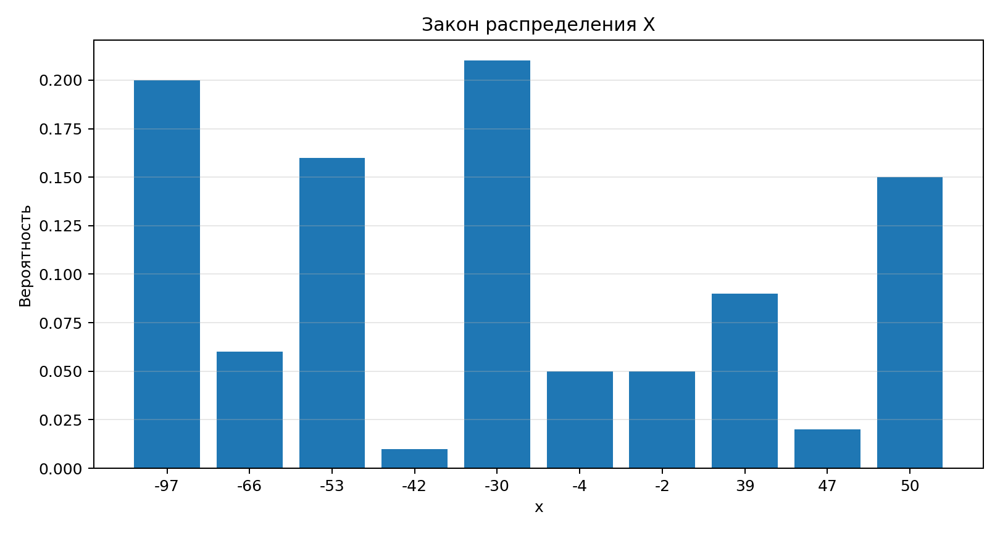
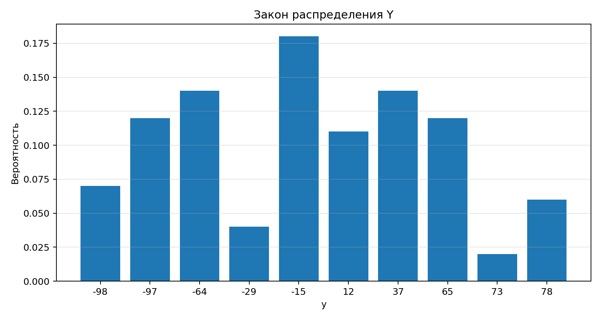
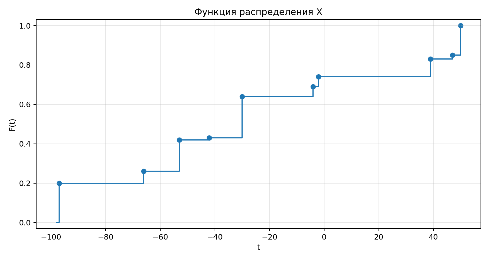
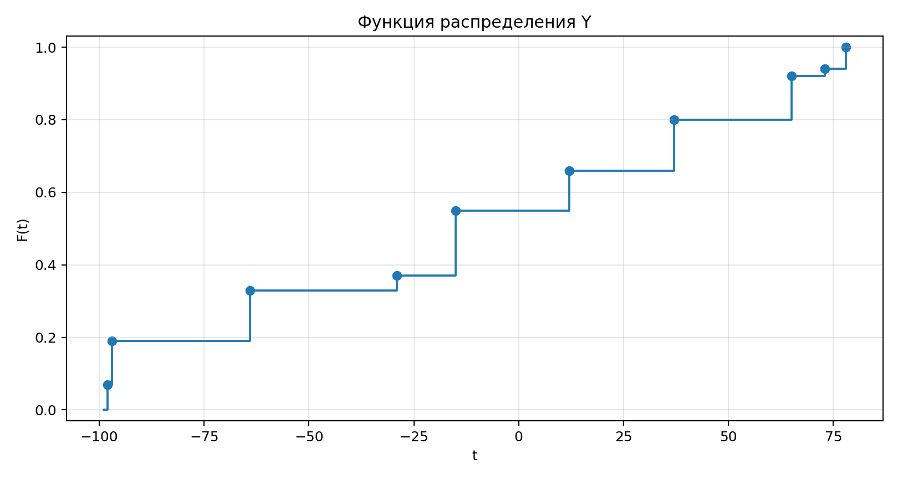
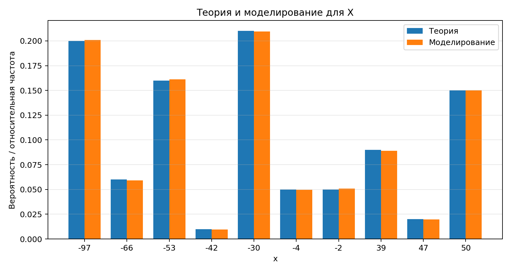
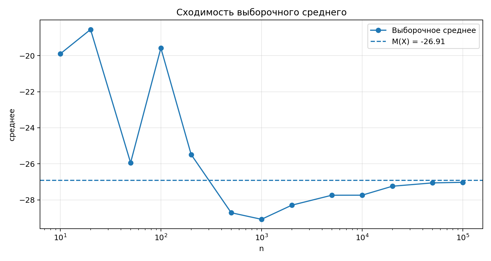

## Расчетно-графическое задание по ту теме: «Многомерные распределения»
Выполнила: Грицай Полина М3232, 4 вариант


## Блок 1. Аналитическое решение

### Задание 1. Таблица закона распределения (неполная)

| X\Y | -98 | -97 | -64 | -29 | -15 | 12 | 37 | 65 | 73 | 78 |
| --- | --- | --- | --- | --- | --- | --- | --- | --- | --- | --- |
| -97 | 0.014 | 0.024 | 0.028 | 0.008 | 0.036 | 0.022 | 0.028 | 0.024 | 0.004 | 0.012 |
| -66 | 0.0042 | 0.0072 | 0.0084 | 0.0024 | 0.0108 | 0.0066 | 0.0084 | 0.0072 | 0.0012 | 0.0036 |
| -53 | 0.0112 | 0.0192 | 0.0224 | 0.0064 | 0.0288 | 0.0176 | 0.0224 | 0.0192 | 0.0032 | 0.0096 |
| -42 | 0.0007 | 0.0012 | 0.0014 | 0.0004 | 0.0018 | 0.0011 | 0.0014 | 0.0012 | 0.0002 | 0.0006 |
| -30 | 0.0147 | 0.0252 | 0.0294 | 0.0084 | 0.0378 | 0.0231 | 0.0294 | 0.0252 | 0.0042 | 0.0126 |
| -4 | 0.0035 | 0.006 | 0.007 | 0.002 | 0.009 | 0.0055 | 0.007 | 0.006 | 0.001 | 0.003 |
| -2 | 0.0035 | 0.006 | 0.007 | 0.002 | 0.009 | 0.0055 | 0.007 | 0.006 | 0.001 | 0.003 |
| 39 | 0.0063 | 0.0108 | 0.0126 | 0.0036 | 0.0162 | 0.0099 | 0.0126 | 0.0108 | 0.0018 | 0.0054 |
| 47 | 0.0014 | 0.0024 | 0.0028 | 0.0008 | 0.0036 | 0.0022 | 0.0028 | 0.0024 | 0.0004 | 0.0012 |
| 50 | 0.0105 | 0.018 | 0.021 | 0.006 | 0.027 | 0.0165 | 0.021 | 0.018 | 0.003 | ? |

### Задание 2. Восстановление пропущенной вероятности

Воспользуемся свойством закона распределения, условием нормировки:

$$\sum_i\sum_j p_{ij}=1.$$


```
Сумма известных вероятностей = 0.991
P(X=50, Y=78) = 0.009
Сумма p_ij = 1
```

Полная таблица закона распределения:

| X\Y | -98 | -97 | -64 | -29 | -15 | 12 | 37 | 65 | 73 | 78 |
| --- | --- | --- | --- | --- | --- | --- | --- | --- | --- | --- |
| -97 | 0.014 | 0.024 | 0.028 | 0.008 | 0.036 | 0.022 | 0.028 | 0.024 | 0.004 | 0.012 |
| -66 | 0.0042 | 0.0072 | 0.0084 | 0.0024 | 0.0108 | 0.0066 | 0.0084 | 0.0072 | 0.0012 | 0.0036 |
| -53 | 0.0112 | 0.0192 | 0.0224 | 0.0064 | 0.0288 | 0.0176 | 0.0224 | 0.0192 | 0.0032 | 0.0096 |
| -42 | 0.0007 | 0.0012 | 0.0014 | 0.0004 | 0.0018 | 0.0011 | 0.0014 | 0.0012 | 0.0002 | 0.0006 |
| -30 | 0.0147 | 0.0252 | 0.0294 | 0.0084 | 0.0378 | 0.0231 | 0.0294 | 0.0252 | 0.0042 | 0.0126 |
| -4 | 0.0035 | 0.006 | 0.007 | 0.002 | 0.009 | 0.0055 | 0.007 | 0.006 | 0.001 | 0.003 |
| -2 | 0.0035 | 0.006 | 0.007 | 0.002 | 0.009 | 0.0055 | 0.007 | 0.006 | 0.001 | 0.003 |
| 39 | 0.0063 | 0.0108 | 0.0126 | 0.0036 | 0.0162 | 0.0099 | 0.0126 | 0.0108 | 0.0018 | 0.0054 |
| 47 | 0.0014 | 0.0024 | 0.0028 | 0.0008 | 0.0036 | 0.0022 | 0.0028 | 0.0024 | 0.0004 | 0.0012 |
| 50 | 0.0105 | 0.018 | 0.021 | 0.006 | 0.027 | 0.0165 | 0.021 | 0.018 | 0.003 | 0.009 |


### Задание 3. Многомерная функция распределения

Формула функции разпределения:

$$F_{X,Y}(x,y)=P(X < x,Y < y)=\sum_{x_i\le x}\sum_{y_j\le y}p_{ij}.$$

Если `x<-97` или `y<-98`, то `F_{X,Y}(x,y)=0`. Если `x_i <= x < x_{i+1}` и `y_j <= y < y_{j+1}`, то значение функции равно накопленной сумме из таблицы ниже.

`F_{X,Y}(x,y)=0`, при `x≥50,y≥78`.

| X\Y | -98 | -97 | -64 | -29 | -15 | 12 | 37 | 65 | 73 | 78 |
| --- | --- | --- | --- | --- | --- | --- | --- | --- | --- | --- |
| -97 | 0.014 | 0.038 | 0.066 | 0.074 | 0.11 | 0.132 | 0.16 | 0.184 | 0.188 | 0.2 |
| -66 | 0.0182 | 0.0494 | 0.0858 | 0.0962 | 0.143 | 0.1716 | 0.208 | 0.2392 | 0.2444 | 0.26 |
| -53 | 0.0294 | 0.0798 | 0.1386 | 0.1554 | 0.231 | 0.2772 | 0.336 | 0.3864 | 0.3948 | 0.42 |
| -42 | 0.0301 | 0.0817 | 0.1419 | 0.1591 | 0.2365 | 0.2838 | 0.344 | 0.3956 | 0.4042 | 0.43 |
| -30 | 0.0448 | 0.1216 | 0.2112 | 0.2368 | 0.352 | 0.4224 | 0.512 | 0.5888 | 0.6016 | 0.64 |
| -4 | 0.0483 | 0.1311 | 0.2277 | 0.2553 | 0.3795 | 0.4554 | 0.552 | 0.6348 | 0.6486 | 0.69 |
| -2 | 0.0518 | 0.1406 | 0.2442 | 0.2738 | 0.407 | 0.4884 | 0.592 | 0.6808 | 0.6956 | 0.74 |
| 39 | 0.0581 | 0.1577 | 0.2739 | 0.3071 | 0.4565 | 0.5478 | 0.664 | 0.7636 | 0.7802 | 0.83 |
| 47 | 0.0595 | 0.1615 | 0.2805 | 0.3145 | 0.4675 | 0.561 | 0.68 | 0.782 | 0.799 | 0.85 |
| 50 | 0.07 | 0.19 | 0.33 | 0.37 | 0.55 | 0.66 | 0.8 | 0.92 | 0.94 | 1 |

### Задание 4. Маргинальные распределения и функции распределения

Маргинальные вероятности:

$$P_X(x_i)=\sum_j p_{ij},\qquad P_Y(y_j)=\sum_i p_{ij}.$$

$$
F_X(x)=P(X\le x)=\sum_{x_i \le x} P_X(x_i)
$$

$$
F_Y(y)=P(Y\le y)=\sum_{y_j \le y} P_Y(y_j)
$$

 Маргинальное распределение X:

| x | P_X(x) | F_X(x) |
| --- | --- | --- |
| -97 | 0.2 | 0.2 |
| -66 | 0.06 | 0.26 |
| -53 | 0.16 | 0.42 |
| -42 | 0.01 | 0.43 |
| -30 | 0.21 | 0.64 |
| -4 | 0.05 | 0.69 |
| -2 | 0.05 | 0.74 |
| 39 | 0.09 | 0.83 |
| 47 | 0.02 | 0.85 |
| 50 | 0.15 | 1 |

 Маргинальное распределение Y:

| y | P_Y(y) | F_Y(y) |
| --- | --- | --- |
| -98 | 0.07 | 0.07 |
| -97 | 0.12 | 0.19 |
| -64 | 0.14 | 0.33 |
| -29 | 0.04 | 0.37 |
| -15 | 0.18 | 0.55 |
| 12 | 0.11 | 0.66 |
| 37 | 0.14 | 0.8 |
| 65 | 0.12 | 0.92 |
| 73 | 0.02 | 0.94 |
| 78 | 0.06 | 1 |

Гистограммы маргинальных распределений:





Графики функций распределения:





### Задание 5. Числовые характеристики маргинальных распределений

Формулы:

$$E(Z)=\sum_z zP(Z=z),\qquad D(Z)=\sum_z z^2P(Z=z)-E(Z)^2,\qquad \sigma(Z)=\sqrt{D(Z)}.$$

$$
Me(X)=\min\{x_i: F_X(x_i)\ge 0.5\}
$$

$$
Mo(X)=x_k,\quad \text{где } p_k=\max_i p_i
$$

| Величина | E      | D | σ | Me  | Mo  |
| --- |--------| --- | --- |-----|-----|
| X | -26.91 | 2632.1619 | 51.3046 | -30 | -30 |
| Y | -10.88 | 3516.6856 | 59.3016 | -15 | -15 |


### Задание 6. Проверка независимости

Проверяем условие независимости для всех ячеек таблицы:

$$p_{ij}=P_X(x_i)P_Y(y_j).$$


В коде проверены все 100 ячеек. 

```
max |p_ij - P_X(x_i)P_Y(y_j)| = 0
Вывод: X и Y независимы.
```
### Задание 7. Коэффициент линейной корреляции


$$\rho_{X,Y}=\frac{cov(X,Y)}{\sigma_X\sigma_Y},\qquad cov(X,Y)=E(XY)-E(X)E(Y).$$

Вычислили: `E(XY) = 292.7808`, `E(X)E(Y) = 292.7808`, поэтому `cov(X,Y) = 0` и `ρ = 0`.

Коэффициент корреляции равен нулю. Для независимых случайных величин `E(XY)=E(X)E(Y)`, значит ковариация и корреляция равны нулю. Обратное в общем случае неверно.

### Задание 8. Регрессия `Y` на `X`

$$
E(Y\mid X=x_i)=\sum_j y_j \cdot P(Y=y_j\mid X=x_i) =\sum_j y_j \cdot \frac{P(X=x_i,Y=y_j)}{P(X=x_i)}
$$

Так как `X` и `Y` независимы, то

$$
P(Y=y_j\mid X=x_i)=P(Y=y_j).
$$

Следовательно,

$$
E(Y\mid X=x_i)=E(Y).
$$

Так как

$$
E(Y)=-10.88,
$$

то уравнение регрессии `Y` на `X`:

$$
E(Y\mid X=x)=-10.88.
$$


## Блок 2. Моделирование

Для моделирования выберем маргинальное распределение `X`. Используем стандартный датчик равномерных чисел на `(0;1)`: число `u` попадает в один из интервалов накопленной функции распределения `F_X`, после чего возвращается соответствующее значение `X`.

### Задание 1. Генерация данных

Сгенерировано `N=10000` значений величины `X`, интервалы для генерации задаются накопленными вероятностями из таблицы `F_X(x)`.

### Задание 2. Относительные частоты и сравнение

| x | P_X(x) | Относительная частота | Абсолютное отклонение |
| --- | --- | --- | --- |
| -97 | 0.2 | 0.2024 | 0.0024 |
| -66 | 0.06 | 0.0586 | 0.0014 |
| -53 | 0.16 | 0.1651 | 0.0051 |
| -42 | 0.01 | 0.0113 | 0.0013 |
| -30 | 0.21 | 0.2121 | 0.0021 |
| -4 | 0.05 | 0.0484 | 0.0016 |
| -2 | 0.05 | 0.0508 | 0.0008 |
| 39 | 0.09 | 0.0869 | 0.0031 |
| 47 | 0.02 | 0.0197 | 0.0003 |
| 50 | 0.15 | 0.1447 | 0.0053 |



Гистограммы похожи: относительные частоты близки к теоретическим вероятностям. Это объясняется законом больших чисел: при большом числе испытаний частота появления каждого значения стремится к его вероятности.

### Задание 3. Поведение выборочного среднего

Взята возрастающая последовательность: `10, 20, 50, 100, 200, 500, 1000, 2000, 5000, 10000, 20000, 50000, 100000`. Для каждого `n` посчитано среднее по первым `n` сгенерированным значениям.
```   
     n |  среднее
-------+---------
    10 |    -20.5
    20 |   -20.35
    50 |   -30.88
   100 |   -31.59
   200 |   -28.41
   500 |  -25.854
  1000 |  -25.399
  2000 |  -26.101
  5000 | -27.3448
 10000 | -27.1967
 20000 | -27.2475
 50000 | -27.0838
100000 | -26.9268
```



На графике среднее постепенно стабилизируется около теоретического математического ожидания `E(X) = -26.91`. Это также является проявлением закона больших чисел.

